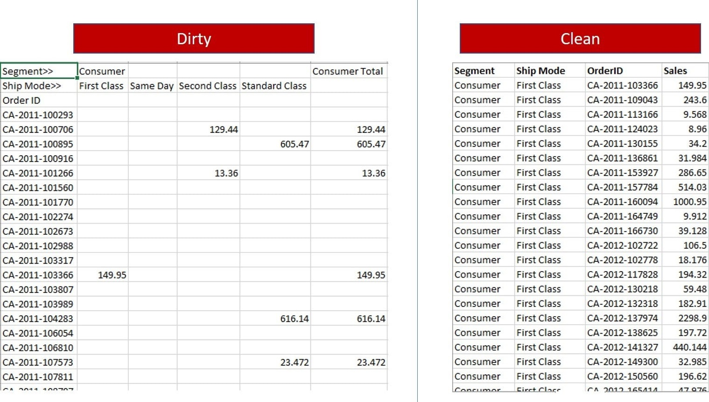

# Badly Structured Sales Data Cleaning using Excel-Power Query

### About this

This is a small data cleaning task for practice available on [Foresight BI](https://foresightbi.com.ng/microsoft-power-bi/dirty-data-samples-to-practice-on/)

### About the dataset

The dataset is a badly structured sales data containing almost 800 rows. There are a mix of rows and columns everywhere in the data. Also we don't need Grand Totals and Sub Totals in the cleaned data as shown in the following image (downloaded from [Foresight BI](https://foresightbi.com.ng/microsoft-power-bi/dirty-data-samples-to-practice-on/)):

### Data Source

Data is available to download here on [Foresight BI](https://foresightbi.com.ng/wp-content/uploads/2020/05/1.-Badly-Structured-Sales-Data-1.xlsx)
Thank to [Ahmed Oyelowo](https://foresightbi.com.ng/author/4eyes/) who made this available.

### Steps to Clean

1. Select the whole data range, go to **Data -> From Table/Range** and open it in **Power Query** 
2. Delete all columns having Totals for Segments
3. Delete the last row having Grand Totals
4. Now Transpose the table with **Transform  -> Transpose**, the values in columns becomes rows and the values in rows becomes columns
5. Fill the blank cells in the Segment column using **Transform -> Fill -> Down**
6. Now promote the first row as Headers so the first row in the table is now used as the column headers using **Transform -> Use first row as header**
7. Now Select the Segment and Shipmode columns and Unpivot other columns, **Transform -> Unpivot Other Columns**
8. Change the column header names as needed
9. Data is clean as needed
10. Close and Load it back to a worksheet

